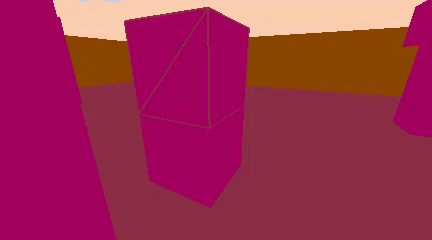
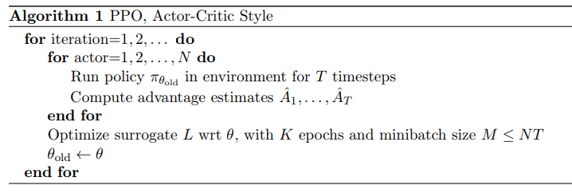
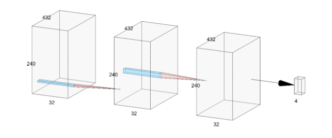
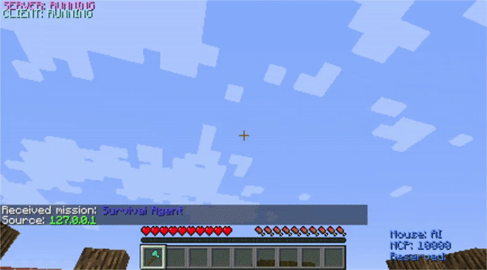
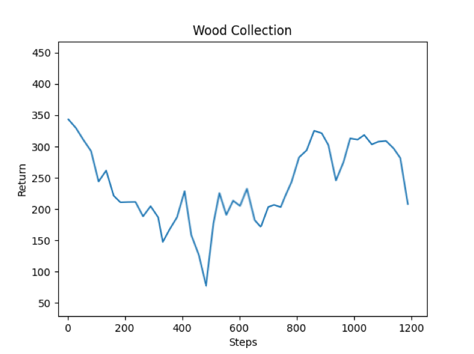
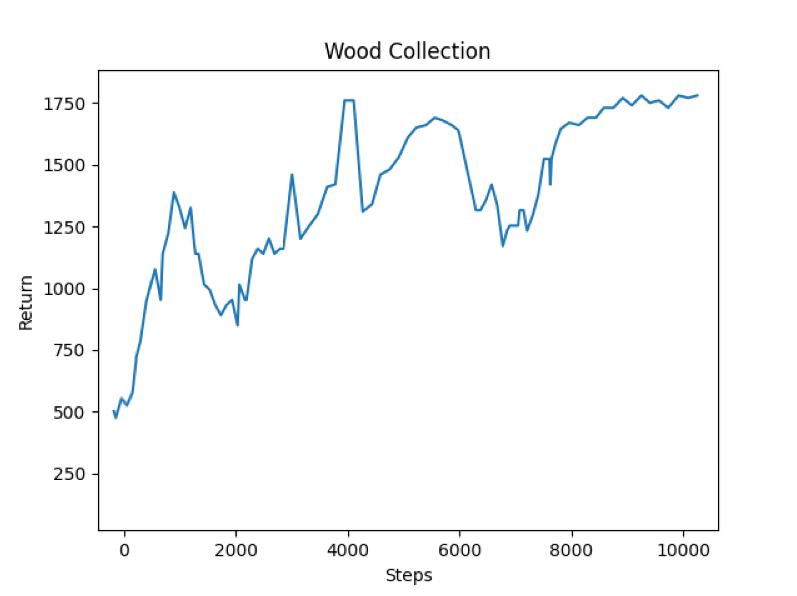
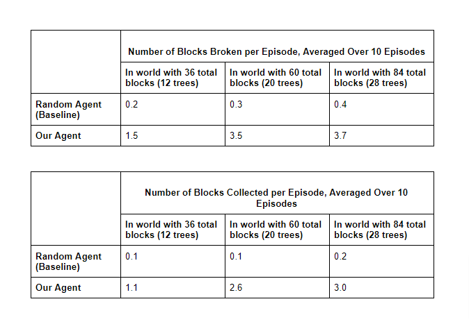
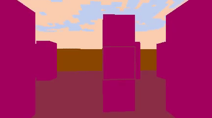

## Video Summary of Project
<iframe width="560" height="315" src="https://www.youtube-nocookie.com/embed/mF-pMlCdZtU?controls=0" frameborder="0" allow="accelerometer; autoplay; clipboard-write; encrypted-media; gyroscope; picture-in-picture" allowfullscreen></iframe>

## Project Summary
Wood is the first item that any new player to Minecraft must collect; it’s the first step into crafting tools and surviving the night. Our agent’s task is to simulate this step: it will identify and harvest wood in order to craft tools that are ultimately used to upgrade equipment and progress in Minecraft’s “survival” mode. Computer vision plays a key role in Surviv.AI; the agent takes in a colormap view of RGB and depth values, detects the objects it needs to collect in the frame, and navigates to these objects.

**The goal is to have the agent rely solely on vision, rather than ObservationFromGrid(as used in assignment 2) to complete simple tasks such as breaking and gathering wood.**

Our project uses computer vision and machine learning to emulate how a person would play Minecraft. For a human it's trivial to identify resources like wood, but teaching an agent to analyze a sequence of pixels and act accordingly would take much more training. We thought this would be an interesting idea to implement (and would be perfect to implement in a ML/AI setting), and so Surviv.ai was born!

*Wood collection is an essential part of surviving the first night in Minecraft; our project aims to automate this task using CV.*

## Approach
Our idea at the beginning of the quarter was to train an agent to detect and harvest materials that are used to progress in Minecraft (wood →  stone →  iron → diamonds). As we worked on our project, we narrowed down our goal to just detecting and harvesting wood given an agent’s visual input.

#### **Computer Vision in Surviv.ai**
Our agent uses raw pixel data from the Malmo colormap video frames to detect and navigate to wood blocks scattered throughout its environment. The colormap assists the agent in **semantic image segmentation**, which is a computer vision task that aims to map each pixel of an image with a corresponding class label. This enables our agent to recognize instances of the same object(wood blocks) and distinguish these from other objects(ie, brick blocks, grass blocks) in the world. Ultimately, we use a PPO Reinforcement Learning algorithm(details of this are further described in the 'Model' section of this report) with a 3-Layer Convolutional Neural Network that takes in a flattened 432x240 image with red, green, blue and depth channels(4x432x240) as input.

*Our agent takes advantage of the semantic segmentation algorithm from Malmo's colormap to identify wood in its environment.*

#### **Rewards**
Our RL agent earns positive rewards for actions related to gathering wood, and negative rewards for actions that are unrelated or detrimental to the overall goal.\
Our positive rewards system consists of:
- +100 for “looking” at wood
    - This means that the majority pixel color in the agent’s center view is (162,0,93), which is the RGB value that the Malmo colormap’s semantic segmentation algorithm assigns to wood in our environment.
- +100 for attacking/touching/breaking wood blocks
- +200 for picking up/collecting wood and adding it to the inventory

Our penalty (negative rewards) system consists of:
- -10 for attacking/touching/breaking the brick blocks that make up the enclosing wall
- -5 for looking at the sky
- -5 for looking at the grass floor

#### **Action spaces**
Our agent’s action space has 4 dimensions: 
- 0: Move (Continuous between -1.0 and 1.0)
- 1: Turn (Continuous between -0.75 and 1.0)
- 2: Attack (Discrete: -1.0 or 1.0)
- 3: Pitch (Continuous between -0.75 and 1.0)
The continuous range was adjusted to prevent the agent from turning or pitching too much in one direction because Malmo has a bias to turn or pitch in the negative direction(ie, up or left).

#### **Observation / Information for the AI**
Our agent takes input from the world state’s pixels and depth in the shape (4,432,240) and translates that into actions: moving, turning, breaking blocks, and pitching. The agent checks the center of the input and breaks the block depending on whether or not it is a wood block. Our agent navigates around a terrain of fixed size with a variable number of trees, turning, pitching, and breaking blocks. 

#### **Model**
We used Proximal Policy Optimization (PPO) in our project because of its ease of use and performance. PPO is a policy gradient method where policy is updated explicitly. It solves one of the biggest problems in reinforcement learning: sensitivity to policy updates. If a policy update is too large, the next batch of data may be collected under a ‘bad’ policy, snowballing the problem even further. PPO prevents the agent from making rapid, unexpected policy changes that might drastically change the way the agent behaves.

*PPO Algorithm Pseudocode from Proximal Policy Optimization OpenAI Paper (Schulman, et al.)*

In this iteration, we introduced a 3-layer convolutional neural network(CNN) and re-configured our PPO trainer to utilize this custom model. CNNs are a deep learning algorithm that are often used in computer vision because they can assign learnable weights and biases to objects in an input image or video frame. We used this algorithm because the amount of preprocessing required in a CNN is relatively low and they avoid the problem of training slowing down as the number of weights/parameters grows by exploiting correlations between adjacent inputs in video frames.

*Our CNN takes in a 240x432 color/depthmap frame with 4 channels(R,G,B,D) and uses 3 convolutional layers with 32 hidden channels each. We feed each observation into a convolutional layer and then feed the result into the nonlinearity relu() function from torch before flattening the result and extracting the policy.*

#### **Milestones Between Status and Final**
Between the status report and the final report we:
- Defined a custom RLlib model with 3 convolutional layers and reconfigured our PPO model to utilize this
- Added pitching to our continuous action space (expanding our action space from 3 dimensions → 4 dimensions)
- Reconfigured our agent’s wood detection process: instead of solely relying on the color of the center pixel, we used a 4x4 pixel window and extracted the majority pixel color within that window to determine if the agent is currently looking at wood. We later increased this field of vision to 8x8 pixels to make our model less likely to miss wood blocks that were slightly off of the center.
- Introduced penalties for attacking the brick wall and looking at non-wood blocks(eg- sky, grass) to discourage our agent from getting “stuck” looking at items of less importance 
- Expanded our rewards system to include rewards for looking at wood and attacking/touching it, rather than just collecting it/picking it up to encourage the agent to spend more time around trees
- Reconfigured the turning speed for continuous movement to 60 degrees

#### **Comparisons with Past Approaches**
Agent
- When we wrote our status report we had not yet finalized a working agent. Our agent at the time didn’t use any RL methods; it was hardcoded to spin to the right at a constant speed of 0.05 and detect and break trees.

Action Space
- Originally our action space had a size of 3: move, turn, and attack. We added pitching to make our agent more complex (at the suggestion of our wonderful TA)

Map
- We increased the number of trees that spawned in the world (from 4 per map to ~20) to make it easier for the agent to train. Instead of spending most of its time walking around, it would encounter more trees, which allowed us to better understand the agent’s performance (with 4 trees, the result of missing a tree would be more impactful than missing a tree in a world with 20).

Rewards
- We increased the positive rewards from 20 -> 100 for the agent because performance was inconsistent. Balancing positive and negative rewards resulted in a more consistent reward graph.

*Our new world with an increased number of randomly-placed trees gives the agent more opportunities to be positively rewarded.*

## Evaluation

#### **Quantitative Evaluation**
In addition to the total returns from our agent(determined by a combination of rewards and penalties for interacting with different block types), we focused our quantitative evaluation on our agent’s “success rate” for breaking and picking up wood blocks; the metrics we used for this were the percentage of the total wood blocks that were broken per trial, as well as the percentage of total wood blocks that were collected per trial. For both of these metrics, the higher the percentage, the better the agent’s demonstrated performance was. In our rewards scheme, we ended up weighting block collection more heavily than block breakage, since the ultimate goal of harvesting wood is to add this resource to the agent’s inventory(as opposed to just breaking the blocks and leaving them uncollected in the world). We used a random, “blind” agent as our baseline, and trained our agent so that it uses vision to do a more **effective**(ie, standing there long enough to break the block and pick it up) and **efficient**(ie, moving in the right direction of the wood more often rather than aimlessly wandering around) job of collecting wood than a “blind” agent.

Reward returns for our “blind,” random baseline agent:

Reward returns for our “seeing” agent:

#### **Qualitative Evaluation**
We also evaluated our agent’s performance qualitatively by watching it detect and gather wood in its environment; more specifically, we examined if the agent was able to adequately pitch and move so that it was able to thoroughly break blocks as opposed to simply moving past them or not attacking long enough to break them. We also visually examined our agent to see if it got stuck in the corners of our brick wall enclosing, or if the agent was staring at the grass/sky/brick wall for too long as it was looking for wood, and used these manual observations to construct our penalty system. We also examined the extent of “improvement” from our baseline by looking at how quickly the agent was able to locate wood as it became exposed to more training(ie, did it look like our agent was able to locate wood “sooner” as a result of more training?). Ultimately, we noticed that as the amount of training would increase, the agent appeared to learn strategies for locating wood such as backing up to “zoom out” if it was looking at a non-wood block for too long. We also verified that our agent was issuing the “correct” actions as it interacted with specific block types by watching our the video feed generated from our colormap, which uses semantic segmentation to map unique RGB values to unique block types.

*As part of our qualitative evaluation, we manually observed colormap footage such as that pictured above to verify that our agent was aiming for blocks with a (162, 0, 93) RGB value.*

#### **Future Work + Areas For Improvement**
Although our agent was more successful than our baseline in the overall task of finding, breaking, and gathering wood blocks, there were still some aspects in which its performance could have been better. These include:
* **Breaking the floor:** The agent occasionally broke the floor if it pitched downwards by a value extremely close to 1.0 while attacking. We aimed to minimize this by penalizing the agent for touching/breaking the “dirt” block type, but there were still cases in which the agent would attack the floor, create a hole, fall into it, and get stuck, which would ultimately be detrimental to the overall goal in that this would obscure the agent’s vision or limit its mobility. A possible solution to this in future iterations would be to increase the penalty amount for breaking the floor, and to reward the agent for smaller pitches and penalize it for more extreme pitches.
* **Not breaking the closest block first:** The agent doesn’t always turn towards the nearest wood block, or navigate to the logs in the most efficient order. We did extract depth data from the depth map and initially planned to find a way to integrate this into helping our agent identify the closest log as a nice-to-have, but we ultimately ran out of time to implement this.
* **Not collecting all of the blocks that were broken:** As shown in the tables above, the average number of blocks that were actually picked up is typically less than the number of blocks that were broken. In our current iteration, our agent’s movement is based on the assumption that if it moves around in the vicinity of the tree after breaking some of its blocks, the agent is bound to pick up those blocks. However, this is not typically the case, since the only block of “importance” to our agent is any block in its field of vision with an RGB value of (162,0,93), which is the RGB value that the Malmo colormap’s semantic segmentation algorithm assigns to wood in our environment. Since the colormap assigns an RGB value of (0, 255, 68) to the block fragments that result from breaking a whole block, a remedy for this problem that could be implemented in future iterations is to assign “importance” to blocks with this “fragment” color by rewarding the agent for touching them in a way that is similar to how we currently reward the agent for touching/attacking the wood blocks with the “whole” (162,0,93) color. 

## Resources Used
Surviv.ai was built using the following resources: 
- <a href="https://www.microsoft.com/en-us/research/project/project-malmo/">Microsoft's Project Malmo</a> 
- <a href="https://microsoft.github.io/malmo/0.30.0/Schemas/Mission.html#element_AgentHandlers">Malmo XML Schema Documentation</a> 
- <a href="https://github.com/kchian/ForkThePork">ForkThePork project from Fall 2020</a> 
- <a href="https://www.youtube.com/watch?v=nMzoYNHgLpY">Custom RLlib model with Malmo - YouTube (TA video from Campuswire)</a> 
- <a href="https://github.com/microsoft/malmo/blob/master/Malmo/samples/Python_examples/radar_test.py">Malmo radar_test.py Tutorial</a> 
- <a href="https://github.com/microsoft/malmo/blob/master/Malmo/samples/Python_examples/depth_map_runner.py">Malmo depth_runner.py Tutorial</a> 
- <a href="http://microsoft.github.io/malmo/0.14.0/Python_Examples/Tutorial.pdf">Malmo tutorial_5.py</a> 
- <a href="https://github.com/microsoft/malmo/blob/master/Schemas/Types.xsd">Malmo types.xsd</a> 
- <a href="https://openai.com/blog/openai-baselines-ppo/">OpenAI Documentation on PPO</a> 
- <a href="https://medium.com/datadriveninvestor/which-reinforcement-learning-rl-algorithm-to-use-where-when-and-in-what-scenario-e3e7617fb0b1#:~:text=It%20can%20be%20observed%20that,hence%20requires%20several%20add%2Dons.&text=TD3%20and%20TRPO%20work%20well,lack%20the%20faster%20convergence%20rate">Which RL Algorithm to use- where, when, and in what scenario? - Medium</a> 
- <a href="https://medium.com/intro-to-artificial-intelligence/proximal-policy-optimization-ppo-a-policy-based-reinforcement-learning-algorithm-3cf126a7562d#:~:text=Proximal%20Policy%20Optimization(PPO)%2D,732%20Followers">Intro to PPO - Medium</a> 
- <a href="https://medium.com/analytics-vidhya/coding-ppo-from-scratch-with-pytorch-part-3-4-82081ea58146">Coding PPO - Medium</a> 
- <a href="https://www.youtube.com/watch?v=5P7I-xPq8u8">Policy Gradient Method and PPO: Diving into Deep RL - YouTube</a> 
- <a href="https://adventuresinmachinelearning.com/convolutional-neural-networks-tutorial-in-pytorch/">Convolutional Neural Networks Tutorial in PyTorch</a> 
- <a href="https://towardsdatascience.com/a-comprehensive-guide-to-convolutional-neural-networks-the-eli5-way-3bd2b1164a53">A Comprehensive Guide to Convolutional Neural Networks</a> 
- <a href="https://www.jeremyjordan.me/semantic-segmentation/">Intro to Semantic Segmentation</a> 
- <a href="https://jonathan-hui.medium.com/rl-proximal-policy-optimization-ppo-explained-77f014ec3f12">PPO, Explained</a> 
- <a href="http://www.minecraft101.net/g/first-night.html">Survival in Minecraft (source of image in project summary)</a> 
- <a href="https://arxiv.org/pdf/1707.06347.pdf">Proximal Policy Optimization Algorithms Paper- Schulman, et al. </a> 

