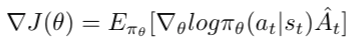
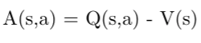
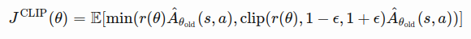
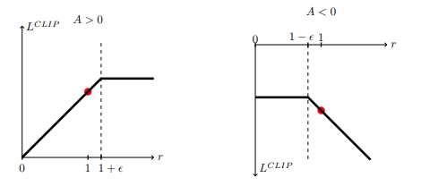
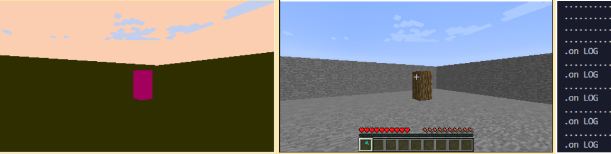
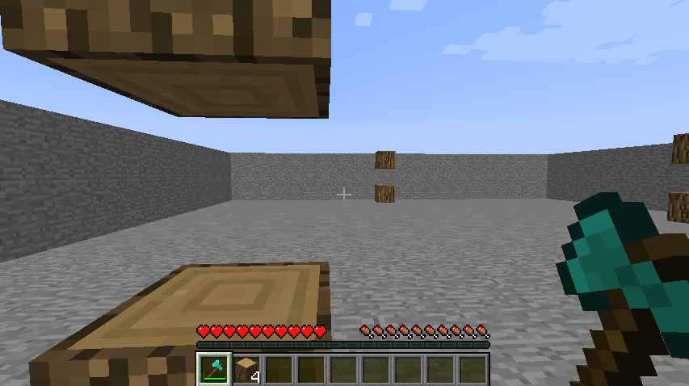

## Video Summary of Project
<iframe width="560" height="315" src="https://youtu.be/_RrEJiJDdLg" frameborder="0" allowfullscreen></iframe>

## Project Summary
Wood is essential for crafting objects in Minecraft, and in general, it can be a useful item to have in one’s inventory. Our project focuses on helping the agent identify and harvest wood, which would ultimately enable it to craft tools that could then be used to collect other key items in a “survival” mode game of Minecraft. Computer vision with the use of a color map plays an essential role in our project; the agent takes in a view, detects the objects it needs to collect(ie, forms of wood such as simple logs and more complex trees) in the frame, and navigates to these objects. The goal is to have the agent rely solely on vision, rather than observation from grid-- which constitutes "cheating"-- to complete simple tasks such as harvesting wood. In later stages, we hope to implement a timer system that dictates the timeframe in which the agent must collect a certain quantity of wood, or perhaps a crafting goal such as building a table from the objects collected.

## Approach
We chose to use Proximal Policy Optimization (PPO) in our project because of its ease of use and performance.

PPO is a policy gradient method where policy is updated explicitly. To understand PPO, we need to first understand the standard policy loss function, which looks like  ([source](https://lilianweng.github.io/lil-log/2018/04/08/policy-gradient-algorithms.html#trpo))

$$\log\pi_{\theta}(a_{t}\mid s_{t})$$ represents the probabilities of actions for a given state that the neural net suggests, and the advantage function $$\hat{A_t}$$ is an estimate of “how good” an action is.

 ([source](https://www.youtube.com/watch?v=5P7I-xPq8u8))

The advantage function tells us how much better/worse the current action is compared to the average the action at that state is. Q(s,a) returns the weighted sum of all past rewards (with more recent ones weighted higher than future ones) and V(s) returns an estimate of the average expected reward for a given state. If the return (Q(s,a)) is larger than the expected reward for the current state, then the action has 'exceeded expectations' and should be more likely in the future.

Now onto PPO and the problem it solves.

**Problem**: Reinforcement learning suffers from a sensitivity to policy updates. If a policy update is too large, the next batch of data may be collected under a ‘bad’ policy, snowballing the problem even further. 

**Solution**: There are many solutions, one of the most similar to PPO being Trust Region Policy Optimisation(TRPO). PPO and TRPO both prevent the agent from making rapid, unexpected policy changes that might drastically change the way the agent behaves. 

 ([source](https://lilianweng.github.io/lil-log/2018/04/08/policy-gradient-algorithms.html#trpo))

Here's the actual PPO loss function. The expected value is the minimum of the regular policy gradient and a truncated version of the regular policy gradient (min(regular_policy, truncated_policy)).

 ([source](https://arxiv.org/abs/1707.06347))

In the 2 images, you can see the function for when an action yielded better than expected returns (left) and worse (right). When an action has better yields, it becomes more probable up until a certain point. The loss function flattens out after r passes a threshold so that the behavior does not become too likely (for example, you get a rush of dopamine after eating sugar so you become more likely to eat sugar, however too much sugar is bad for your body so you don't want to eat too much). When an action has worse yields, we want to make it less probable proportional to how bad the action was.

## Evaluation
There are two main metrics of evaluation, the first being the current RGB colored pixel (s) at the center of the Malmo agent’s view, and collection of the wooden log item itself.

Since our approach relies on the value of the center pixel (s) from the color map, we can evaluate the functionality of this feature visually and programmatically. The color map can be printed out per frame, which we use to check qualitatively (in real time) that our implementation functions properly. This is also measured quantitatively by checking the number of frames that have wood’s color as the center pixel (s) until actual collection of the log. Eventually, we intend to swap to an x by y window view of pixels, where rewards can be associated with all pixels (higher rewards for ones closer to the center).

Quantitatively, we also measure the success rate of log collection. Block collection results in a +10 reward in a 10x10 training world for this iteration of the project. 4 logs are placed, each 3 blocks high with 1 in each quadrant. As of now, the AI consistently succeeds in breaking the block at height 2 and only that block on each log, since pitch change has not yet been added as a possible action. This can be viewed as a 30% success rate on average, measured by number of logs collected out of a total of 12. This is much higher than random action, which < 1% success rate.

Overall, we evaluated our agent qualitatively by doing a visual check during the actual training. Since our training environment is walled off, we did not have to worry about any major outside variables like never finding a log or falling off an edge. The goal was to see what general trends our agent favored or got stuck in.

Doing this showed that the agent has a tendency to spin in place to try to line up a log in its center pixel, occasionally not registering the center pixel if it spins too fast. This qualitative analysis is also how we noticed that the agent would only succeed in breaking the y=2 wood log block, though it can successfully move towards those logs that it is unable to break so long as the center pixel is RGB value associated with wood on the color map.

The agent handler <RewardForTimeTaken> will be used in future implementations to tie rewards to the amount of time taken to find a tree. Graphs detailing returns over time  (using matplotlib) will also be added.

## Remaining Goals and Challenges
Our prototype is limited in that it is not yet capable of pitching/tilting its perspective to recognize that there are wood blocks below(y=1) and above(y=3) the ones placed at y=2. We believe that this is primarily due to the fact that our agent only examines a single pixel at the center of the current colormap frame, rather than looking at a slice of multiple pixels, to compare the current view's RGB values to those expected for wood. In the coming weeks, we thus plan to make our agent's wood collection more "complete" by modifying our detection algorithm to encapsulate a broader view of our target logs, so that it is capable of seeing and attacking logs at different angles. We hope to achieve this by enlarging the RGB comparison window and have the agent continue to attack as long as there are remaining pixels with the wood RGB value that fall within that window. Instead of evaluating the RGB value of a single center pixel and using this as the only criteria for halting a turn and subsequently attacking, we plan to construct a vertical, horizontal, or cross-shaped window that examines a region of pixels and gets the majority "vote" color to compare to the expected color for wood. Another major goal of ours is to modify the agent to recognize and collect wood when it is presented in more complex forms such as trees, as opposed to simple logs. We also anticipate adding complexity to our world by introducing obstacles such as lava, or other non-wood items like stone blocks that the agent needs to locate and harvest in addition to wood. Moreover, since the transition probabilities are unknown, the action space is continuous, and the state space is very large, we opted to use a deep reinforcement learning approach with PPO. However, in future iterations, we also plan to experiment with other algorithms such as Deep Q-learning with an epsilon-greedy approach, A3C, or TRPO, and visually compare the results with those from our current iteration to determine if the agent performs better than it currently does with PPO. 

We also plan to make several modifications to our agent's movement. Currently, our agent utilizes continuous movement to turn at a very slow rate of 0.05. We set this low value to ensure that as the agent was training, it was able to have enough time to register the updated RGB values with the arrival of each new frame as the agent moved around. For our next iteration, we plan to explore ways to enhance our agents performance by making it move faster(and thus find and navigate to the wood blocks more quickly), and tune this parameter to find the optimal turning speed. We would also like to expand the action space for the agent's movement in the direction of the wood logs. As of the current iteration, our agent always moves forward by 0.7 units to approach the log; however, this deterministic behavior sometimes causes the agent to run past, keep running into, or stop short of, the log. The agent also doesn't always turn towards the nearest block, or navigate to the logs in the most efficient order. Currently, it is programmed to turn 0.05 units right until it locates its next log, but this is inefficient in scenarios where there is a closer tree located to the left of the center pixel. To remedy this, we plan to try extracting data from the frames in the depth map and integrate these additional observations into our training function.
 
## Resources Used
Surviv.ai was built using the following resources: 
- <a href="https://www.microsoft.com/en-us/research/project/project-malmo/">Microsoft's Project Malmo</a> 
- <a href="https://microsoft.github.io/malmo/0.30.0/Schemas/Mission.html#element_AgentHandlers">Malmo XML Schema Documentation</a> 
- <a href="https://github.com/kchian/ForkThePork">ForkThePork project from Fall 2020</a> 
- <a href="https://github.com/microsoft/malmo/blob/master/Malmo/samples/Python_examples/radar_test.py">Malmo radar_test.py Tutorial</a> 
- <a href="https://github.com/microsoft/malmo/blob/master/Malmo/samples/Python_examples/depth_map_runner.py">Malmo depth_runner.py Tutorial</a> 
- <a href="http://microsoft.github.io/malmo/0.14.0/Python_Examples/Tutorial.pdf">Malmo tutorial_5.py</a> 
- <a href="https://github.com/microsoft/malmo/blob/master/Schemas/Types.xsd">Malmo types.xsd</a> 
- <a href="https://openai.com/blog/openai-baselines-ppo/">OpenAI Documentation on PPO</a> 
- <a href="https://medium.com/datadriveninvestor/which-reinforcement-learning-rl-algorithm-to-use-where-when-and-in-what-scenario-e3e7617fb0b1#:~:text=It%20can%20be%20observed%20that,hence%20requires%20several%20add%2Dons.&text=TD3%20and%20TRPO%20work%20well,lack%20the%20faster%20convergence%20rate">Which RL Algorithm to use- where, when, and in what scenario? - Medium</a> 
- <a href="https://medium.com/intro-to-artificial-intelligence/proximal-policy-optimization-ppo-a-policy-based-reinforcement-learning-algorithm-3cf126a7562d#:~:text=Proximal%20Policy%20Optimization(PPO)%2D,732%20Followers">Intro to PPO - Medium</a> 
- <a href="https://medium.com/analytics-vidhya/coding-ppo-from-scratch-with-pytorch-part-3-4-82081ea58146">Coding PPO - Medium</a> 
- <a href="https://www.youtube.com/watch?v=5P7I-xPq8u8">Policy Gradient Method and PPO: Diving into Deep RL - Youtube</a> 